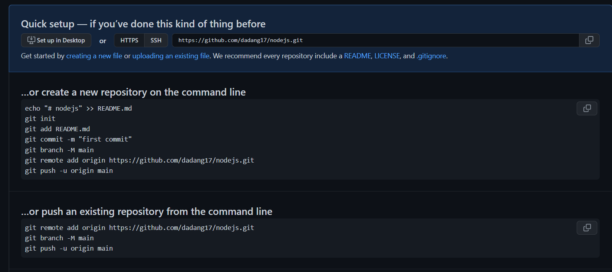

# Writing and Presentation Test Minggu 1

## **Unix Command Line**

### Pengertian Umum

- Shell merupakan bentuk komunikasi atau perantara yang digunakan antara user dan sistem operasi dalam berkomunikasi
- Command Line interface merupakan tampilan dari sebuah terminal yang digunakan untuk menjalankan suatu program, mengelola file, dan berinteraksi dengan komputer. Command Line merupakan sebutan untuk shell yang berbasis teks
- Cara Mengakses CLI yaitu dengan menggunakan terminal pada sistem operasi. Contoh terminal basic atau basic shell pada windows adalah powershell dan commandpromp (CMD).

  - Terminal powershell

  - Terminal CMD<br />

- Sebuah filesystem mengatur bagaimana data disimpan di dalam sebuah system. Sistem operasi Windows & Unix-like menyusun file dan direktori menggunakan struktur yang bentuknya mirip tree.
- Perbedaan Bentuk File System Pada Unix dan Windows 

### a. Navigation files dan directory

- pwd digunakan untuk melihat posisi directory terkini
- ls digunakan untuk melihat isi files suatu directory
  ls - la untuk melihat isi files yang dihidden
- cd merupakan command untuk berpindah directory
- mkdir digunakan untuk membuat directory baru

### b. File Manipulation

- Touch (namafile) digunakan untuk membuat file pada terminal basic di linux
- ni digunakan untuk membuat file di windows
- mkdir merupakan command untuk membuat directory baru
- cp digunakan untuk menyalin file
- cp -r digunakan untuk menyalin directory
- mv digunakan untuk memindahkan atau mengubah nama file dan directory  
  mv [namafile] [namafilebaru]
- rm merupakan command untuk menghapus files
- rm -r digunakan untuk menghapus directory

## **Git dan Github**

### Pengertian Umum

- Git atau Github merupakan tools yang membantu sebuah developer untuk mengembangkan productnya saat development. Git atau github dapat menyimpan perubahan yang akan disimpan pada straging. selain itu git juga dapat membantu saat developer ingin kembali ke sebelum perubahan atau restore codingan.
- Git merupakan tools dalam memversikan program  
  Git digunakan sebagai version control system serta dapat digunakan untuk melacak segala perubahan pada suatu file atau folder maupun source code
- Vendor Git yaitu Github, Gitlab, Bitbucket
  Github merupakan vendor git yang paling umum digunakan dan sebagai tempat penyimpanan Git Repository
- Alur Git 

### Setup Awal GIT

- Konfigurasi git  
  git config global user.name "dadang" <br />
  git config global user.email dadangiskandar17@gmail.com
- Melihat hasil konfigurasi dengan git config --list
- Membuat Repository <br />
  git init (dilakukan didalam folder yang dibuat)
- git Status digunakan untuk melihat apakah terjadi perubahan atau tidak pada Git
- git add untuk menambah file baru/file yang telah diubah pada Git
- git remote menghubungkan remote repository dengan project local yang telah kita buat direktorinya
- git commit -m "commit message" digunakan untuk menyimpan perubahan pada Git
- git push -u origin master digunakan untuk mengirimkan/perubahan file ke remote repository
- git branch -b [nama branch] digunakan untuk membuat branch baru
- git checkout digunakan untuk berpindah branch
- git merge digunakan untuk menggabungkan branch cabang ke branch master ( git merge origin/(nama branch))
- git clone digunakan untuk mengclone atau menggandakan file yang di repositori ke device kita. Contoh Clone :
  - Menggunakan Terminal git bash <br />
  - Meng-clone otomatis langsung di web github<br /> 
  - Menggunakan View->Command Palette (Khusus VSC)
- Contoh Konfigurasi Git 

## **HTML**

- HTML atau _Hypertext Markup Language_ yang berfungsi menampilkan konten di browser
- Tools yang dibutuhkan untuk untuk membuat HTML yaitu web browser dan code editor
- Visual Studio Code merupakan salah satu code editor yang dibuat oleh Misrosoft
- Keunggulan dari Visual Studio Code yaitu Intellisense, Run and Debug,Built in Git, Extensions
- HTML Structure

```
<!DOCTYPE html>
<html lang="en">
<head>
    <meta charset="UTF-8">
    <meta name="viewport" content="width=device-width, initial-scale=1.0">
    <title>My Blog</title>
    <link href="coba.css" type="text/css" rel="stylesheet"/>
</head>
    <body>
        <div>
            <h1 class="header">Hello World!</h1>
            <p>Let's Start learning HTML</p>
        </div>
    </body>
</html>
```

- HTML Element terdiri atas opening tag, content, dan closing tag <br />
  Opening Tag : `<p>` <br />
  Content : Hello World <br />
  Closing Tag : `</p>`
- HTML Attributes : properties dari sebuah element HTML. Contohnya yaitu id,class,name
- Single Tag atau singular tag <br />
  `<br/>` <br />
  `<hr/>` <br />
  ` `
- Paired Tag atau double Tag <br />
  `<h1> </h1>`
- HTML Comment digunakan untuk memberi keterangan pada suatu line code `<!-- -->`
- Salah satu cara menjalankan HTML yaitu menggunakan "Live Server" bisa menggunakan Visual Studio Code
- Pembuatan Tabel

```
        <table border="1">
            <thead>
                <tr>
                    <td>Nama</td>
                    <td>Umur</td>
                    <td>Hobby</td>
                </tr>
            </thead>
            <tbody>
                <tr>
                    <td>Dadang</td>
                    <td>22 Tahun</td>
                    <td>Nonton Anime</td>
                </tr>
            </tbody>
        </table>
```


- Semantic HTML yaitu menggunakan elemen HTML sesuai dengan kebutuhan konten. Contoh yaitu header, footer, nav, section, aside, dll.

```
<body>

  <header>
    <h1>My Blog</h1>
  </header>

  <nav>
    <a href="#">Home</a> |
    <a href="#">About</a> |
    <a href="#">Contact</a>
  </nav>

  <article>
    <h1>Welcome To My Blog!</h1>
    <p>Perkenalkan nama saya Moch. Iskandar Zulqornaen salah satu penimba ilmu website development di Skilvul Tech4Impact: Back-end Web Development
    </p>
  </article>

  <footer>
    Copyright &copy; 2022 by Iskandar
  </footer>

</body>
```


## **CSS**

- CSS atau _Cascading Style Sheets_ yang digunakan untuk mendesain halaman website dengan mengubah warna, menggunakan font custom, editing text format, mengatur tata letak.
- Struktur CSS <br />
  ```
    .elementHTML{
     property : value }
  ```
- . (titik) : merupakan selektor yg menuju pada tag html yg memiliki properti kelas
- CSS comment dapat diberika di external css dan internal css `/* */ `
- Ada 3 cara menggunakan CSS yaitu : inline tag, internal style dan external style <br />
  Inline Tag : menggunakan css lngsng di atribute elemnt html <br />
  Internal Tag : menggunakan tag style di bagian head <br />
  External Tag : menggunakan file css terpisah dengan html
- Properti CSS contohnya yaitu font-size, color, background-color
- Cara mengakses file .CSS di HTML <br />
  `<link href="styles.css" type="text/css" rel="stylesheet"/>`
- CSS - Tag Name <br />
  jika menggunakan Tag element HTML maka akan bersifat global yg artinya akan mengubah seluruh html <br />

```
  h1 {
      color: blue;
   }
```

- CSS - Class Name dengan cara menggunakan selector class <br />

```
   .text-color-red{
	        color: red;
    }
```

- Tag Id dan Tag Class bisa dipake di css namun Tag Class lebih bersifat fleksibel karena dapat diberikan lebih dari 1 nilai sedangkan
  Tag Id bersifat kaku karena hanya memiliki 1 nilai
- Nested Element yaitu setiap element yang terdiri atas parent dan child
- !important CSS yaitu styling CSS yang memiliki tingkat paling atas dari ID dan Class.

### FLEXBOX

- Flexbox adalah suatu cara untuk mengatur layout atau tata letak
- Flexbox terdiri 1 parent (container) dan bisa beberapa child
- Flex direction digunakan untuk mengatur letak child
- Flex wrap mengatur tata letak child pada 1 line
- Flex flow yaitu digunakan sebagai shortcut untuk set up flex-direction dan flex-wrap secara bersamaan
- Order digunakan untuk ordering item yang ingin diatur posisinya
- Justify - content digunakan untuk mengatur tata letak antar item child secara horizontal
- Align - content digunakan untuk mengatur tata letak antar item child secara vertikal atau cross axis
- Flex-grow digunakan untuk mengatur size suatu item child pada flexbox
- Flex-shrink digunakan untuk memperkecil size suatu item child secara relatif terhadap item child lainnya
- flex-basis digunakan untuk mengatur width setiap item child

## **Algorithm and Pseudocode**

- Algoritma adalah deskripsi berupa step-step yang dibutuhkan untuk mnyelesaikan suatu masalah
- Algoritma berfungsi untuk menyelesaikan masalah secara runut
- Kualitas suatu algoritma :
  - Input & output harus jelas/ didefinisikan terlebih dahulu dgn tepat
  - Setiap step harus benar -benar clear dan tidak ambigu
  - Algoritma seharusnya tidak mengandung suatu code pada bahas pemrograman tertentu. <br />
    algoritma harus dibuat agar dapat digunakan dlm bahas pemrograman apapun
- Kenapa harus mempelajari algotima :
  - Pemrograman merupakn algoritma dan struktur data
  - Data struktur dgunakan untk mngelola sebuah data
  - Algoritma menyelesaikan suatu permsalahan mnggunakn sbuah data trsbut
- Contoh Algoritma

```
Input 1 = 10
Input 2 = 5
Output = Input 1 + Input 2
Print ("Result", output)
```

- Pseudocode merupakan tools yang digunakan untuk menulis algoritma
- Panduan menulis pseudocode :
  - Huruf kapital digunakan untuk menulis perintah
  - 1 statement hanya terdiri dari 1 baris
  - Menggunakan indentasi
  - Harus bersifat spesifik dan simple
- Contoh Pseudocode

```
Deklarasi
Jam, Detik
INPUT jam
	  Convert Jam ke Detik (*3600)
DISPLAY result
```

- Jenis Pseudocode :
  - Procedural : cara berpikir runut
  - Conditional: jika dibutuhkan suatu percabangan masalah (if else)
  - Looping : sebuah perintah yg diulang-ulang
  - Recursive : sebuah perintah yang memanggil method/function didalam sebuah function
